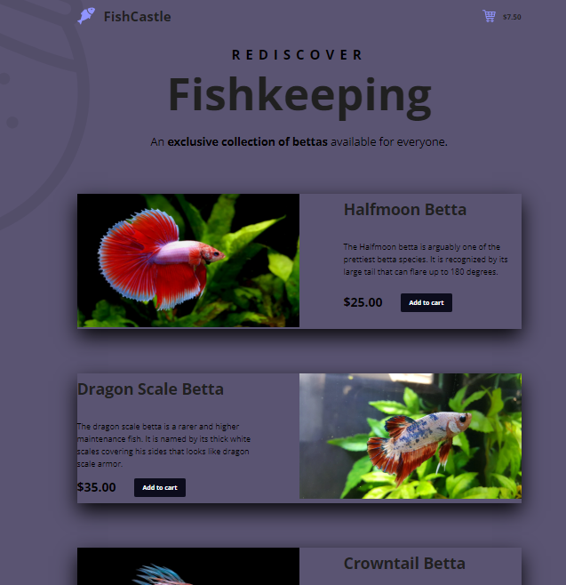

# *Snipcart_NextJS*

**Snipcart_NextJS** is an ecommerce web application created with Next.js and Snipcart.
Next.js is a JavaScript framework that allows you to make web applications and also server-side rendering.
Snipcart is a shopping cart platform to that allows you to add the most common e-commerce features 
to any website or web application in minutes.

## User Stories

The following functionality is completed:

- [x] User can look into different products on the page.
- [x] User can add one or many products to cart.
- [x] The number of products and amount of money is shown.
- [x] Checkout page is shown after button is clicked.

## Demo

Here's a demo of implemented user stories:

## Open-source libraries used

- [Snipcart](https://app.snipcart.com/register) - Snipcart account
- [Node.js](https://nodejs.org/en/) - JavaScript runtime environment.
- [Npm](https://www.npmjs.com/) - Install and develop Next.js framework.
- [Next.js](https://nextjs.org/) - Application production and server side rendering.

